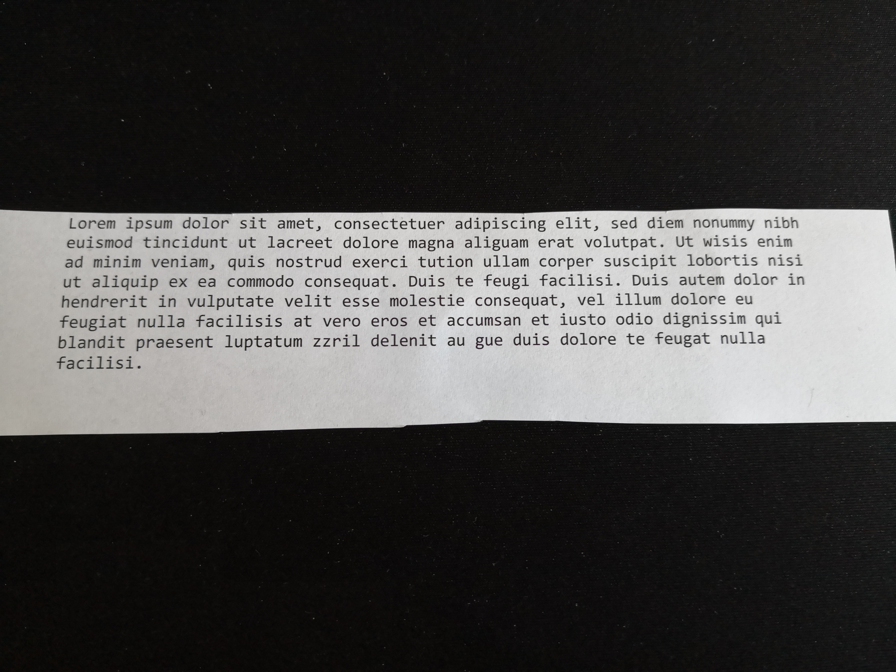
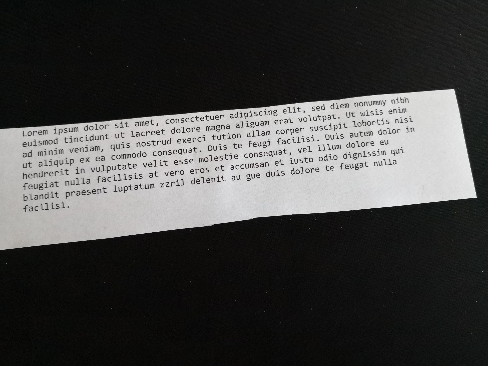

# Image to text and PDF

- [Image to text and PDF](#Image-to-text-and-PDF)
  - [The idea](#The-idea)
  - [Sample](#Sample)
  - [Installation](#Installation)
    - [Docker Hub](#Docker-Hub)
    - [Manually](#Manually)
  - [Running the script](#Running-the-script)
    - [Docker Run](#Docker-Run)
      - [Image From Dockerhub](#Image-From-Dockerhub)
    - [Python](#Python)
  - [Functions](#Functions)
    - [Folder option](#Folder-option)
    - [Image option](#Image-option)
  - [Drawback](#Drawback)
  - [Credits](#Credits)

## The idea

I enjoy the thrive to the paperless world, as I find it much easier organizing digital documents. But since many documents are still required as a hardcopy, one is still forced to archive those.

In order to reduce the amount of time spent organizing those documents, I bought a numbering stamp. This stamp automatically increases the number with each stamping. It is put on each document. Then I take a picture of all documents. After that, the images are organized in folders by the name of the number on the document. Then a python script is started with the path to the images. This script takes one to many images per document, tries to align them in a way that the text is "as horizontal as possible". This is done, since one easily is off by a few degrees when taking pictures with a camera or a phone. Then the slightly rotated images are stored to a pdf and used to extract text from them. This text then is stored to txt-files. The hardcopy documents are now simply archived in order of the number of the stamp. Whenever I now need a certain document, I can simply search for it on the computer and it will tell me, which number the document has.

## Sample

Following a sample usage of this tool (assuming the [installation](#installation) has been done based on docker hub).

1. Take pictures of your hardcopy documents and put them into a proper directory structure with good names. The folder names are the names of the output (following ```001``` and ```002```).

```vim
images
|
|─001
| | image.jpg
|
|─002
  | skew_image.jpg
```
Here the contents of the images:




2. Open up your terminal and navigate to the parent folder of ```convert```.

3. Execute the [command](#Image-From-Dockerhub) with your input parameters. In this case: ```docker run --rm -it -v $(pwd)/images:/app/convert:ro -v $(pwd)/result:/app/result aaj07/image-to-pdf-and-txt```

Following the output of the commands:


4. Have a look at the ```result``` directory to see, if everything went well enough.

## Installation

The tool is based on Python 3.

With docker, it is rather simple to install the tool, but it is not required.

### Docker Hub

The easiest way to use this tool is to install it from the docker hub:

```docker pull aaj07/image-to-pdf-and-txt```

Have a look at the [docker hub](https://hub.docker.com/r/aaj07/image-to-pdf-and-txt) for the released versions and further information.

### Docker Build

Go to the folder where the Dockerfile is located and execute following command:

```docker build -t image-to-pdf-and-txt .```

### Manually

It is also possible to install the dependencies for the python script by yourself:

1. Go to the folder, where the project is located.
2. ```pip install -r requirements.txt```
3. Install the packages ```tesseract-ocr``` and ```tesseract-ocr-deu```.  

The ```tesseract-ocr-deu``` package is required to have German language support. There are several others, which can be added.

## Running the script

Again, it is possible to run the script manually or via Docker.

In general, the script does four steps:

1. Collect a list of pdfs to be produced.
2. Rotate the image. Often the text is a bit skew, if one takes the images by hand, through which the OCR result tends to be worse.
3. Extract the text and store it to a text file.
4. Takt eh rotated images and store it to a pdf.

### Docker Run

The script allows you to either define a folder, where the images are located in, or directly provide the path to the images.

When using docker, it is advisible to use the default command, which uses the folder option. Depending on where you got the image from, the command can vary. Following the two examples matching the previously described ways of either retrieving or creating the image. Of course one can also create a own tag for the image.

#### Image From Dockerhub

```docker run --rm -it -v $(pwd)/convert:/app/convert:ro -v $(pwd)/result:/app/result aaj07/image-to-pdf-and-txt```

#### Image Built Locally

```docker run --rm -it -v $(pwd)/convert:/app/convert:ro -v $(pwd)/result:/app/result image-to-pdf-and-txt```

The two volumes/directories used in the ```docker run``` command are:

- ```result```: This is where the text files and the PDFs are stored to.
- ```convert```: This is the folder, where the images, which shall be converted, are located at.

The script uses your current working directory.

### Python

Using the manually installed version, one can simply use ```python3 main.py -f convert```.

## Functions

The script currently has to ways of being used: By providing a folder, where the images to be converted is given, or by providing the images in the command line.

### Folder option

The folder option takes one folder and searches recursively for images. The expected input is a folder, where subfolders are given including the images and each subfolder represents one document. For each subfolder, a pdf and a txt file is created. See following example:

```
convert
|
|─0001
| | Img1.jpg
| | Img2.jpg
|
|─0002
| | Img3.jpg
|
|─0003
  | Img4.jpg
  | Img5.jpg
  | Img6.jpg
```

When passing the folder "convert" to the script, the output would be as follows:

```
result
| 0001.txt -> Contains the extracted text from Img1.jpg and Img2.jpg.
| 0001.pdf -> Contains the images Img1.jpg and Img2.jpg.
| 0002.txt -> Contains the extracted text from Img3.jpg.
| 0002.pdf -> Contains the images Img3.jpg.
| 0003.txt -> Contains the extracted text from Img4.jpg, Img5.jpg and Img6.jpg.
| 0003.pdf -> Contains the images Img4.jpg, Img5.jpg and Img6.jpg.
```

The order of the images in the folder is sorted by name. So the PDF and the text document will keep the order of names. (e.g. Img4 is followed by Img5 and then Img6, despite the creation date).

### Image option

The image option allows you to directly pass the images to the python script. It is also possible to define one to many pages per document:

```python3 main.py -i folder/Img1.jpg,folder/Img2.jpg -i folder/Img3.jpg -i folder/Img4.jpg,folder/Img5.jpg,folder/Img6.jpg```

The output would be as followed:

```
result
| Img1.txt -> Contains the extracted text from Img1.jpg and Img2.jpg.
| Img1.pdf -> Contains the images Img1.jpg and Img2.jpg.
| Img3.txt -> Contains the extracted text from Img3.jpg.
| Img3.pdf -> Contains the images Img3.jpg.
| Img4.txt -> Contains the extracted text from Img4.jpg, Img5.jpg and Img6.jpg.
| Img4.pdf -> Contains the images Img4.jpg, Img5.jpg and Img6.jpg.
```

Using the image flage, the order is not based on the name, but rather on the order provided to the script.

## Drawback

The image must have a good resolution and the text must be well readable, otherwise the output will not be all that great. In that case, it is possible that searching fails. But it is possible to add descriptive names to the number of the folder name through which manual searching can be improved.

## Credits

Since I was completely new to Python and further being new to OCR, I had to find my way through the internet to create this tool. The [Py Image Search-Page](https://www.pyimagesearch.com/) helped me a lot, specially the blog entry about [the text skew correction](https://www.pyimagesearch.com/2017/02/20/text-skew-correction-opencv-python/). The text skew correction was pretty much taken from that entry, with some minor adaptions.
